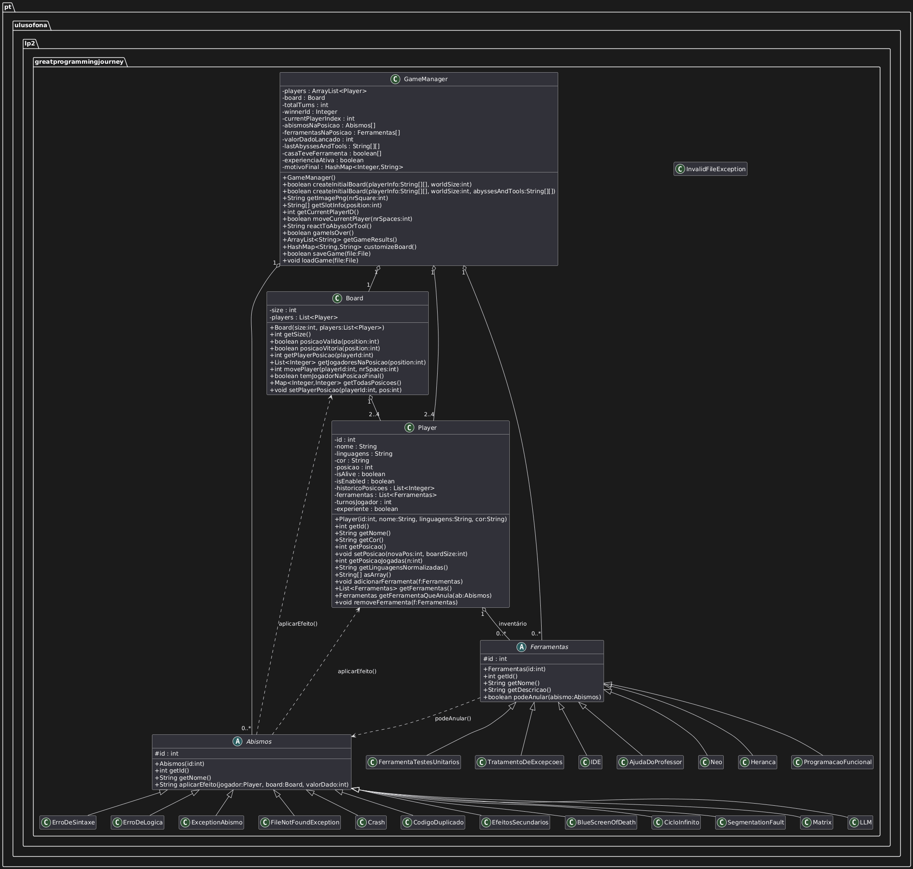

https://www.youtube.com/watch?v=eBzVMK5mTQc

Novo Abismo: Matrix (id 10)
Nova Ferramenta: Neo (id 6)

Motivação da Ideia:
Eu tive a ideia de criar algo com Matrix porque gosto muito do filme e
acho que tem tudo a ve com informatica, além disso, achei que seria algo completamente diferente
dos outros abismos dando a oportunidade do jogador escolher o seu destino, mas tendo em conta a sorte.

Abismo Matrix (id 10) — Descrição do Comportamento

O abismo Matrix representa um momento de decisão crítica para o programador. Quando um jogador cai numa casa com este abismo:

Se o jogador possuir a ferramenta Neo (id 6), o abismo é anulado, consumindo a ferramenta, e nenhum efeito é aplicado.

Caso contrário, o jogador é obrigado a escolher entre:
Pílula Azul
Pílula Vermelha
Esta escolha resulta num efeito positivo ou negativo, mas a associação entre pílula e efeito não é fixa, o que impede que o comportamento seja previsível.

Regras dos Efeitos:
O efeito aplicado é sempre 3× o valor do dado lançado no turno.

Em cada activação do abismo:
Um dos efeitos corresponde a um prémio (o jogador avança 3× o valor do dado).
O outro corresponde a uma punição (o jogador recua 3× o valor do dado).
A ordem inicial (qual pílula é prémio e qual é punição) é aleatória no início do jogo.
Após cada activação do abismo, a ordem inverte-se, garantindo que o comportamento não possa ser antecipado pelos jogadores.
Desta forma, o jogador nunca sabe se a pílula azul ou a vermelha será benéfica ou prejudicial, reforçando a ideia de escolha e incerteza associada ao universo Matrix.

Ferramenta Neo (id 6) — Descrição do Comportamento

A ferramenta Neo foi criada especificamente para interagir com o abismo Matrix.
A ferramenta Neo permite anular exclusivamente o abismo Matrix.
Quando utilizada, é consumida, tal como acontece com as restantes ferramentas anuladoras do jogo.
Não tem efeito sobre outros abismos.
Esta ferramenta representa simbolicamente o personagem Neo, que no filme é capaz de “quebrar” as regras da Matrix e escapar às suas consequências.

Características Distintivas:

O abismo Matrix e a ferramenta Neo distinguem-se dos restantes elementos do jogo pelos seguintes motivos:

Introduzem escolha explícita do jogador, em vez de um efeito automático.
Possuem comportamento não determinístico, dificultando a previsão do resultado.
O efeito depende do histórico de activaçõess anteriores do próprio abismo.
Existe uma ligação temática e funcional direta entre o abismo e a ferramenta que o anula.

Testes Unitários

Foram desenvolvidos testes unitários específicos para validar o comportamento do abismo Matrix, garantindo que:

O id e o nome do abismo estão corretos.
O avanço e o recuo correspondem corretamente ao prémio e à punição.
A ordem dos efeitos alterna entre ativações.
A pílula azul não corresponde sempre ao prémio, confirmando o carácter não previsível do abismo.